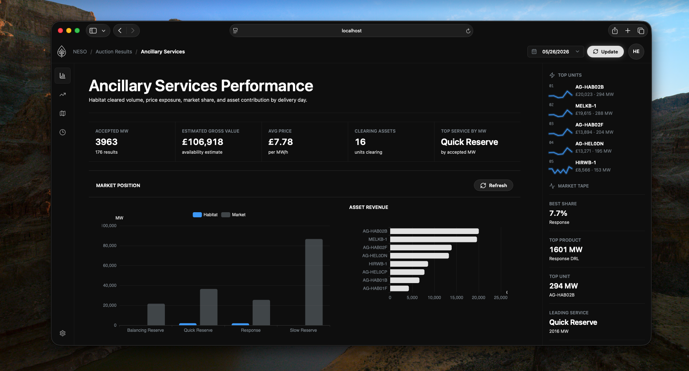

# Habitat Auction Results Dashboard

A small market dashboard for Habitat Energy's NESO auction results.

NESO data is pulled by the Python backend, normalized, stored in Postgres, and then read by the Vue app through our own API. The browser does not fetch NESO directly.



## Run Locally

Install once:

```bash
cd backend
python3 -m venv .venv
source .venv/bin/activate
pip install -e ".[dev]"

cd ../frontend
bun install
```

Add env files:

```text
backend/.env
frontend/.env.local
```

Then from the repo root:

```bash
./dev.sh
```

Open:

```text
http://localhost:5173
```

## Load Data

Use the dashboard date picker and click `Update`.

Or call the backend:

```bash
curl -X POST "http://localhost:8000/api/ingest?date=2026-05-26"
```

Check the stored data:

```bash
curl "http://localhost:8000/api/summary?date=2026-05-26"
```

## Shape

```text
NESO API -> FastAPI ingestion -> Postgres -> FastAPI reads -> Vue dashboard
```

Stored:

- Habitat accepted results
- market service totals
- ingestion run history

Derived:

- cleared MW
- estimated gross value
- clearing prices
- market share
- product, window, and asset performance

## Railway

Backend:

```text
Root: backend
Start: uvicorn app.main:app --host 0.0.0.0 --port $PORT
```

Frontend:

```text
Root: frontend
Build: bun run build
Start: bun run start
VITE_API_BASE_URL=<backend url>
```
